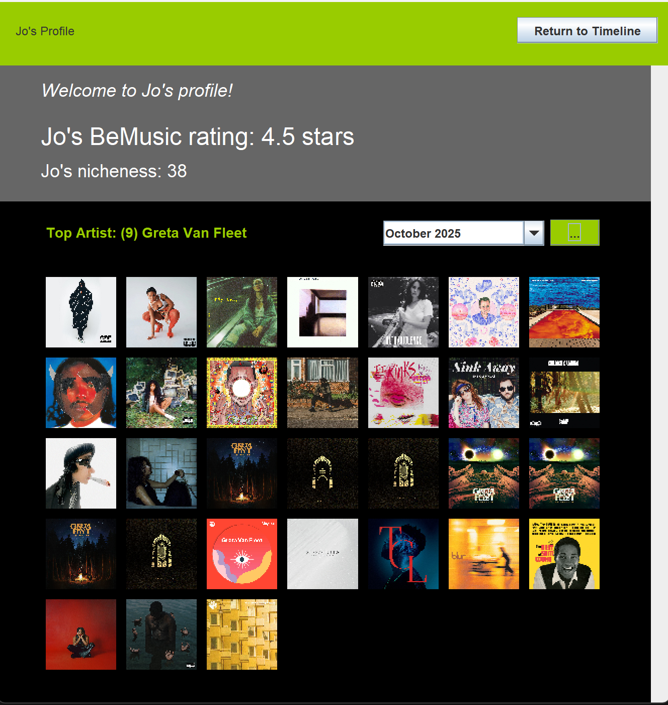
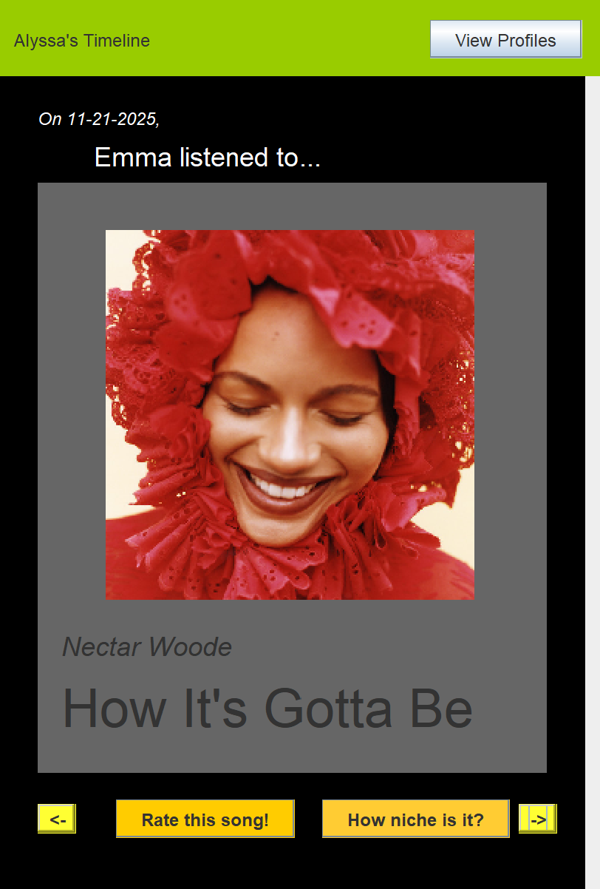
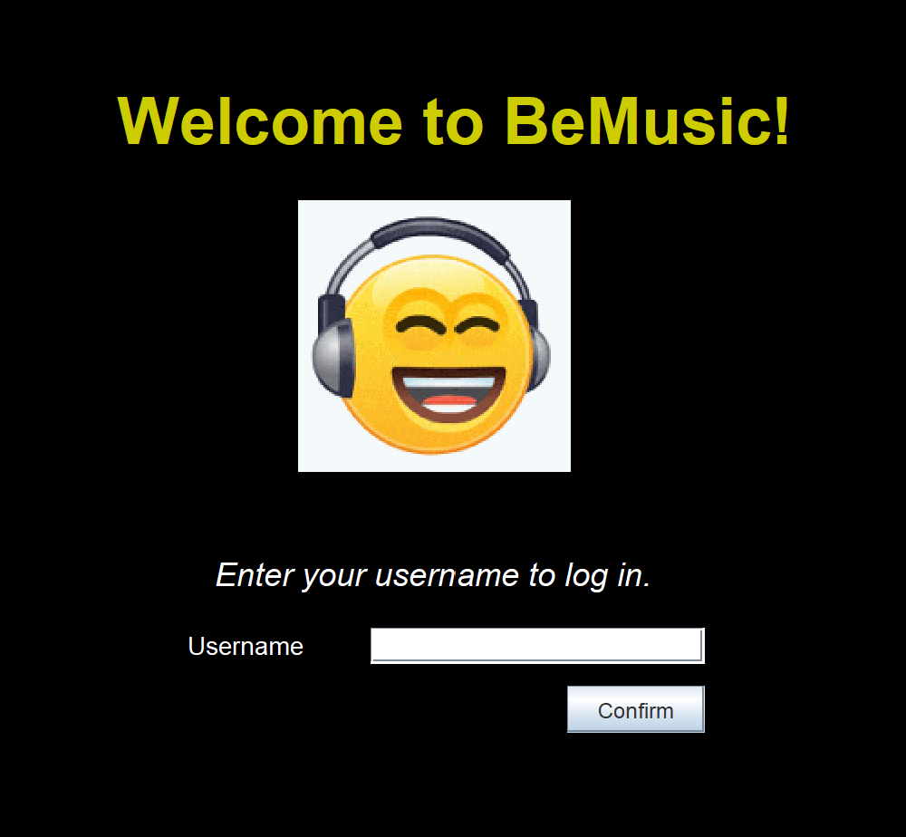

# BeMusic

Inspired by BeReal, the daily photo journal that goes off at random points in the day, we are making BeMusic. BeMusic will contain two main displays: 1) your personal profile that works as your music journal, and includes your music recaps by month, and 2) your feed, which includes the most recent posts from your friends in chronological order, newest posts on top.

BeMusic is not a live-running app. Instead, it looks at the music history of our peers and presents it in a fun, interactive format where you can rate your friend's music tastes and see how niche they are!

## Demo

[(Click here for a video demo of how to use BeMusic :P)](youtubeLink)

**Example of Your Profile**
\
A person's personal profile, with their overall rating and music nicheness score. Music calendars can be loaded for the months of October and November. The music calendar is full of the album covers of the songs listened to on various days. On top of the calendar is also their top artist for that month as well as the number of times they listened to that artist.

**Example of Your Feed**
\
A user's feed shows the songs their friends have listened to in reverse-chronological order. You can click back and forth on the feed to view different posts. For each post, it displays your friend's username, the song title and artist, and the album cover. You can rate the song (which will contribute to your friend's overall rating), as well as view how niche that particular song is. Note that songs which could not be found on Spotify will display an "Image not Found" image, and their nicheness score defaults to 100 (song sooooo underground it could not be found on Spotify!).

## External Libraries:

**TO RUN THIS PROGRAM, YOU MUST HAVE JAVA 25!** To download and find more information on JDK 25, visit: https://www.oracle.com/java/technologies/downloads/.

We used the SpotifyAPI to take our users song history and get deatils from Spotify, such as track title, artist(s), url to the track's album cover, and the track's "popularity score", which is a Spotify-made score from 0 (not popular) to 100 (very popular).

The OpenCSV library is used to simplfy parsing in data from listening_data.csv to populate our users and their listening histories.

Apache NetBeans is used to format and display the GUI.

These APIs and libraries are managed through the pom.xml file that keeps track of dependencies.

## Use Instructions:

To run the BeMusic application, run the RunBeMusic main class file.

RunBeMusic

    main - Initializes database and loads GUI on Login window.

This will ask you to login.
\
**YOU CAN ONLY LOGIN TO EXISTING ACCOUNTS!** Below is a list of all users you can login as (capitalization matters). Their friendships are hard-coded in RunBeMusic.java.

Existing Users: Alyssa, Cris, PJ, Jo, Emma, Ethan, Aniyah, Andrea, Hansel, Hasseit, Vanessa, Nelson, Amri, Tomy, Gwyn, Carmen, Lili, Julia, Liz, Kieran, Maela, Rhea, Jaden, PJ, Aami

**Other Classes & Public Methods**\
Below is a list of all the classes avalaible, their public methods (including usage examples), though to use the intended program, only the RunBeMusic.java file is needed to start the program.

BeMusicDatabase

    Behaves like a normal Graph data structure, able to add and remove vertices and edges.

    getUser(String username) - returns the user associated with the given username (no duplicate usernames are allowed)
        Ex: getUser("pj") returns BeMusicUser("pj")

BeMusicUser

    friends() - returns an ArrayList of the users friends.
        Ex: pj.friends() returns [BeMusicUser("alyssa"), BeMusicUser("cris")]

    addFriend(BeMusicUser newFriend) - adds a BeMusicUser object to the adjacency list of the current user.

    removeFriend(BeMusicUser newFriend) - removes a BeMusicUser object to the adjacency list of the current user, if that friend exists.

    getRating() - returns the user's average rating from the ratings.txt file
        Ex: alyssa.getRating() returns 4.9

    rate(int rating) - takes in a rating inputed into a user's song, and updates the ratings.txt file.Does not return anything

    getMusicCalendar(int month, int year) - returns a list of size 31 where each index correponds to the image-url of the song listened to that day

    getFeed() - Get's the ENTIRE song histories of all added friends and formats into an ArrayList of String[] with hardcoded order [date, username, song title, artist, image-url, nicheness score]

    getNichescore() - returns the "nichescore" of the user, or 100 minus the average popularity score based on user's song
        Ex: alyssa.getNicheScore() returns 12 (very niche)

    deleteAccount() - deletes user account (data for user still remains)

ListeningHistory

    getMonthTopArtist(int month, int year) - returns a user's top artist for a given month and year
        Ex: cris.getMonthTopArtist(11, 2025) returns "Tyler, the Creator"

    getSongHistory(int month, int year) - returns a user's song history for a specified month and year as an ArrayList of Song objects.
        Ex: cris.getSongHistory(11, 2025) returns ["By the Sea by Wendy & Bonnie", "Beautiful Soul by Katy J Pearson", "The Wreck of the Edmund Fitzgerald by Gordon Lightfoot", ...]

    getSongHistory() - returns a user's entire song history as an ArrayList of Song objects.
        Ex: cris.getSongHistory() returns ["By the Sea by Wendy & Bonnie", "Beautiful Soul by Katy J Pearson", "The Wreck of the Edmund Fitzgerald by Gordon Lightfoot", ...]

    addSong(Song song) - adds Song object to listening history, formats the date that the song was added, and adds song's artist(s) to the artists history. Does not return anything.

ReadCSV:

    generateDatabase() - reads in a CSV file, creates users, adds in song and date history. Does not return anything

ReadCSVPreprocess:

    preprocess() - runs through the CSV file containing users, songs, artists, and dates and creates a new file that contains everything prior as well as the URL to the album cover and popularity score, if found on the SpotifyAPI

Song:

    getYear() - returns year as an int.
        Ex: getYear() returns 2025

    getMonth() - returns month as an int.
        Ex: getMonth() returns 12

    getDay() - returns day as an int.
        Ex: getDay() returns 11

    getDate() - returns full date as a String.
        Ex: getDate() returns "12-11-2025"

    getTitle() - returns title of song as a String.
        Ex: getTitle() returns "First Rate Town"

    getArtist() - returns artist of song as a String.
        Ex: getArtist() returns "Good Kid"

    getImageURL() - returns url link to the image of album as a String.
        Ex: getImageURL() returns "https://i.scdn.co/image/ab67616d0000b2739e466f8262ef856bc5b70260"

    getPopularity() - returns Spotify's "popularity score" for the song.
        Ex: getPopularity() returns "47"

    getUser() - returns the user that listened to this instace of the song.
        Ex: getUser() returns "Cris"

    setUser(String user) - sets the user that listened to this instace of the song. Does not return anything.

    compareTo(Song that) - compares two songs based on their date, returning -1 if the song was listened to after 'that' and 1 if it was listened to before.
        new Song(Chapter Six,Kendrick Lamar,12/6/2025).compareTo(new Song(Katana,Samara Cyn,12/5/2025)) returns -1

SearchItemExample:

    search(String search) - Makes a call to the SpotifyAPI to get a song's [title, artist, album cover url, popularity score] as an array of Strings.
        Example: SearchItemExample.search("First Rate Town Good Kid") returns [First Rate Town, Good Kid, https://i.scdn.co/image/ab67616d0000b2739e466f8262ef856bc5b70260, 54]

LoginFrame:
Creates the GUI window to 'log in'. Enter a valid username from the preexisting database in order to view that user's timeline.

    bootUp(BeMusicDatabase database) - Initializes Login window when called.

    loading() - Loads image displayed at Login menu.

    confirmActionPerformed(java.awt.event.ActionEvent evt) - Action that occurs when the 'Confirm' button is clicked. Checks if username is valid. If not, prompts user to enter a different username through a Dialog box. If yes, then opens TimelineFrame window.

TimelineFrame:

    Creates the GUI window for the timeline.

ProfileFrame:

    Displays a given user's profile, the month's calendar with the songs they listened to, rating and nicheness score

## Contributors

**PJ James:** \
&emsp; Student at Pomona College, Class of '28 \
&emsp; contact: pjmandelaj@gmail.com | [linkedin](https://www.linkedin.com/in/pj-james-70341533b/)

**Cris Ovalle:** \
&emsp; Student at Pomona College, Class of '28 \
&emsp; contact: @crissovalle2010@gmail.com | [linkedin](https://www.linkedin.com/in/cristofer-ovalle-525008238/)

**Alyssa Wu:** \
&emsp; Student at Pomona College, Class of '28 \
&emsp; contact: zjwualyssa@gmail.com | [linkedin](https://www.linkedin.com/in/zjwualyssa/)
